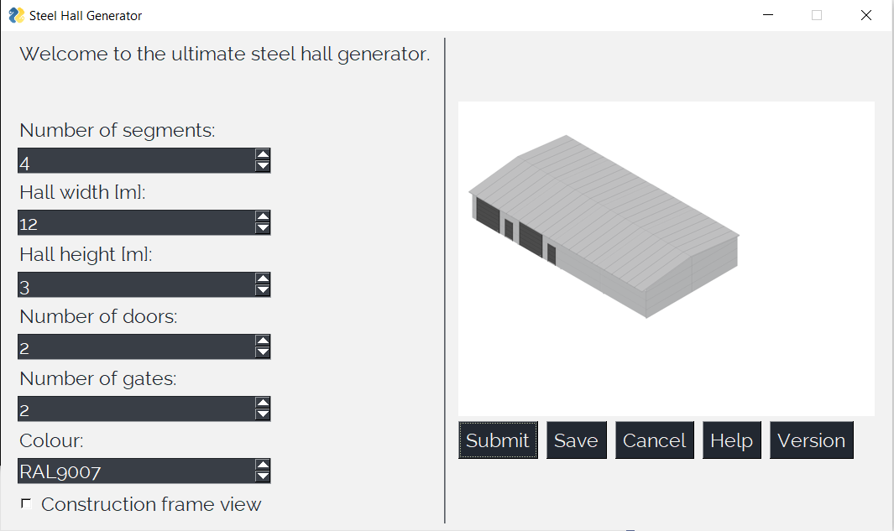

# ULTIMATE-STEEL-HALL-GENERATOR
Steel Hall Parametric Model

Required libraries:
1. PIL
2. PythonSimpleGUI

A simple programme which generates steel hall image in various configurations using PIL library. The image is created from pre-rendered images.

To create an image change options in the left menu column and press a button "Submit". 
To save an image to .png file click "Save" button.

